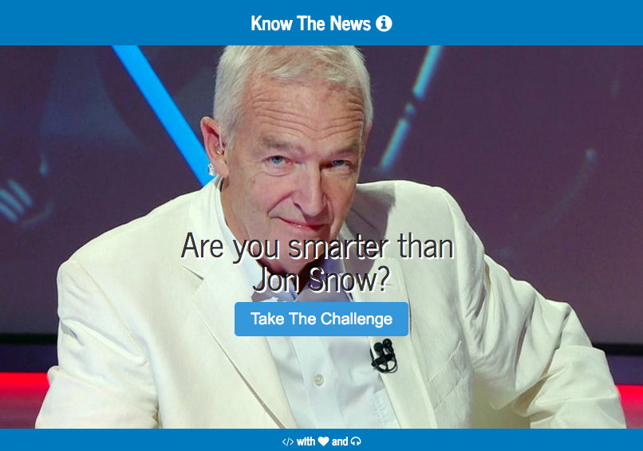

[Link to Game:](https://quiet-ridge-88355.herokuapp.com/)

# About

'Know The News' is a mobile first trivia news game focused on numbers and statistics. Your opponent is famous News Anchorman Jon Snow. He knows almost everything. Not to be mistaken with actor Jon Snow, who, as everybody knows, knows nothing.  

'Know The News' was build as a first coding project during Web Development Immersive at General Assembly London.

### Problems
+ It is getting constantly harder to reach out to a young audience with news information if a news organization doesn't publish everything on Facebook. 
+ Younger people would not only like to read the news but also engage. 
+ News organisation still rely on users coming back to their website. News consumption nowadays works on push mechanism though and less on pull. So news organisations need to think about how people come back (Retention). Thats why users get asked to leave their mobile-number after the game. The number gets stored in a Google Spreadsheet.

### Solution
'Know The News' imparts news information in a gamified and engaging manner and offers the option to get notified when a new game is available (text push).

### How to play

You answer trivia questions and play against Jon Snow, who knows almost everyhting. Jon is very busy and has only a basic news set to play per day. The News you need to know about. If Jon has more News you get notified by text. 

### The Project requirements

+ Display a game in the browser
+ Game should be responsive
+ Game should offer different turns 

### Technologies

'Know The News' is build with HTML/CSS and JavaScript with the following libraries:

+ jQuery
+ jQuery UI
+ jQuery UI Touch
+ Font Awesome

###Credits

+ 'Know The News" by Mathias Menzl 
+ 'Know The News' wouldn't have been possible without the vast coding knowledge of GA Teachers Alex, Caroline and Oli
+ Jon Snow Image courtesy of Channel 4 News
+ Any ressources used were either created by hand or are free of right and duly credited

Feel free to comment and fork.

